

## Réseaux Récurrents

Ce cours a été rédigé, de mémoire, par Manuel Clergue, pour un projet maintenant aussi abandonné que les réseaux récurrents.

Néanmoins il me semble intéressant d'en garder une trace ici...

### Motivations

Jusqu’à présent, les données que nous fournissons à nos réseaux de neurones sont non ordonnées, c’est-à-dire que l’ordre de leur traitement n’est pas pertinent. Et d’ailleurs, lors de l’entraînement du réseau, il est fortement conseillé de les passer dans un ordre aléatoire et changé à chaque époque, pour justement éviter que l’apprentissage soit influencé par un ordre artificiellement créé. Après tout, une image de chat doit rester une image de chat, qu’elle soit précédée ou non par une image de chien dans notre base d’exemples.

Cependant, il est parfois, pour ne pas dire souvent, nécessaire d’apprendre non seulement à reconnaître un objet, mais également reconnaître le déplacement de cet objet (ici les termes reconnaître, objet et déplacement sont à prendre dans le sens le plus général). Prenons un exemple simple et parlant : imaginons une balle (ou tout autre objet à votre convenance) se déplaçant et que nous connaissions seulement la position de cette balle. Il peut être intéressant de pouvoir prédire la position future de la balle. Cette position future est déterminée par les lois de la physique, et dépend de la vitesse et de l’accélération de la balle (et quelques autres paramètres), données dont nous ne disposons pas. Pour pouvoir faire notre prédiction, il est nécessaire d’avoir les positions de la balle dans le passé, sa trajectoire. La position future de la balle peut être ainsi déterminée par ses positions, présentes et passées.

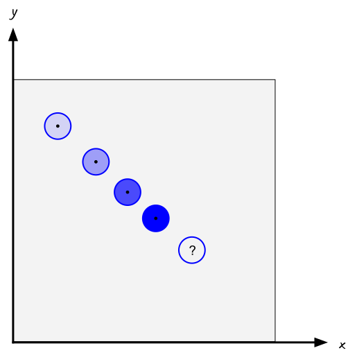

Même si nous ne connaissons pas la physique de l’environnement dans lequel la balle se meut, on peut toujours s’en sortir, en analysant des trajectoires, c’est-à-dire des séquences de positions, et en apprenant les positions futures à partir des positions passées. C’est l’objectif de la modélisation de séquences, tâche pour laquelle les réseaux de neurones récurrents sont par construction très efficaces.

La notion importante est ici celle de séquence. Une séquence de données est une suite ordonnées de données. La nature des données dépend du problème que l’on cherche à résoudre : une suite de positions, comme pour notre exemple précédent, une suite d’images formant une vidéo, une suite de lettres, ou de mots, formant un texte, une suite de sons (ou de notes de musique), une suite de relevés de températures … Les principes que nous utiliserons seront les mêmes, seuls changeront les traitements préalables des données, et éventuellement les dimensions des entrées et des sorties du modèle.

Les applications de la modélisation de séquences sont nombreuses et rentrent dans ces trois classes :

- **prédiction** : déterminer la suite d’une séquence,
- **classification** : associer une catégorie à une séquence,
- **génération** : produire une séquence.

Là où les modèles précédents étaient limités à faire des correspondances un-à-un (une entrée, une sortie), les modèles de séquences peuvent faire des correspondances séquence-à-un (une séquence de données en entrée, une sortie). Par exemple, si on souhaite classer le type de musique à partir d’une partition, si on souhaite prédire la valeur future d’une séquence de données. On peut également souhaiter faire des correspondances un-à-séquence (une donnée d’entré, une séquence en sortie), comme par exemple avec les systèmes de génération de légendes d’images, ou même séquence-à-séquence, dont l’exemple le plus connu est la traduction automatique de texte.

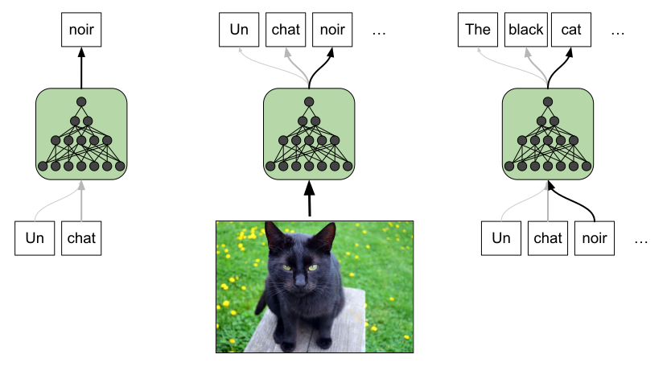

Une **séquence** est une *suite de données ordonnée dans le temps*. 

La **modélisation de séquence** est l'activité qui consiste à *chercher les relations temporelles qui existent entre les données*.

Les réseaux de neurones récurrents sont efficaces pour la modélisation de séquence. Il est néanmoins légitime de se demander si une nouvelle architecture de réseau est réellement nécessaire pour cette tâche. En effet, les réseaux de neurones classiques semblent suffisants. Nous pourrions considérer une séquence comme une donnée, qu’on fournirait en bloc.

Une caractéristique des réseaux profonds est leur robustesse, c'est à dire leur capacité à accepter tous types de données, y compris des séquences. Et avec les réseaux convolutifs, nous avons vu que nous pouvons apprendre efficacement des relations de proximité entre des composantes des entrées, comme avec les pixels d’une image. Les réseaux de neurones récurrents le font plus efficacement, mais nous verrons dans la première section de ce chapitre qu’un réseau profond classique peut effectivement traiter des séquences. Nous en verrons les limites, et c’est ce qui nous permettra d’introduire les réseaux récurrents dans la section suivante.

Cette nouvelle architecture nécessite une modification du processus d’apprentissage, et la rétro-propagation à travers le temps, présentée ensuite est une méthode d’apprentissage spécifique aux réseaux récurrents.

Enfin, je présenterai les réseaux **Long Short Time Memory** et les réseaux **Gated Recurrent Unit** qui sont des évolutions des réseaux récurrents.

### Réseaux profonds pour la modélisation de séquences

Comme nous l’avons vu en introduction, rien n’empêche, en principe, d’utiliser des réseaux profonds pour traiter des séquences. Il suffit de considérer une séquence comme un bloc qui sera fourni au réseau, et nous nous retrouvons avec une application courante des réseaux profonds.

Pour illustrer cela, reprenons notre exemple de la balle qui se déplace dans un plan. Pour simplifier, nous considérerons que la zone de déplacement de la balle est le carré unité dans le plan, et que la balle rebondit sur les parois du carré. Nous ne savons rien de la physique du système (gravité, plasticité, friction, …). Tout ce que nous avons ce sont des enregistrements de la position du centre de la balle mesurée au cours du temps à intervalle régulier.

Imaginons que nous souhaitions connaître la position de la balle au temps $$t$$ en connaissant sa position lors des $$n$$ pas de temps précédents. Vu comme cela, c’est une tâche de prédiction, mais nous pouvons très bien la ramener à une tâche de régression (la régression est processus par lequel nous essayons de modéliser une fonction à partir d’exemples) :

$$ \mathbf{x}^{t} = f(\mathbf{x}^{t-1},\mathbf{x}^{t-2},\ldots,\mathbf{x}^{t-n} ) $$

avec $$\mathbf{x}^{i}$$, le vecteur correspondant à la position de la balle au temps $$i$$.

Pour approximer cette fonction avec une réseau de neurones, nous pouvons découper dans nos enregistrements de trajectoires des blocs de $$n+1$$ positions. Les $$n$$ premières seront fournies en entrées du réseau, et la dernière jouera le rôle de la sortie désirée. Notre réseau en entrée prendra un vecteur de dimension $$n \times 2$$ ($$n$$ couples $$(x,y)$$) et fournira en sortie un vecteur de dimension $$2$$ (un couple $$(x,y)$$).

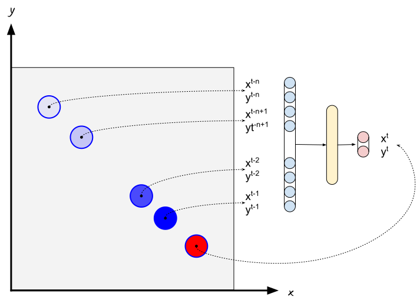

La prédiction de trajectoire, vue comme la prédiction de la position future en fonction des n positions passées, peut être réalisée par un réseau de neurones classique.

Comme toujours avec un réseau profond classique, lors de l’apprentissage la sortie du réseau est comparée à la sortie désirée, ici la position suivant les $$n$$ positions en entrée du réseau, pour calculer l’erreur commise. Comme il ne s’agit pas de données discrètes, pour le calcul de l’erreur nous ne pouvons pas utiliser l’entropie croisée. La racine de la moyenne des carrées fera l’affaire.

La construction des exemples peut se faire de façon exhaustive : si nous disposons d’une trajectoire de $$N$$ points, on peut en extraire $$N-n-1$$ blocs de $$n+1$$ points. Ou bien ne prendre qu’un sous-ensemble de ces blocs. De même, parmi les blocs de la base d’apprentissage, certains serviront pour l’apprentissage, d’autres pour estimer l’erreur de généralisation. Que du classique !

Le choix de $$n$$ (l’historique de la séquence qu’on souhaite prendre en compte) dépend du problème, mais pour notre problème de balle, quelques pas de temps, entre 5 et 10, devraient suffire (après tout, pour estimer l’accélération à partir d’une trajectoire 3 pas de temps sont suffisants).

Les exemples (les blocs de positions) peuvent (doivent, en fait) être passés au réseau dans le désordre lors de l’apprentissage. L’ordre des positions est conservé à l’intérieur des blocs, et c’est à partir de cet ordre que l’apprentissage se fait. Mais ce sont des considérations qui échappent au réseau. La seule chose qu’il cherche à faire c’est d’approximer la fonction $$f$$.

Et sur cet exemple simple, il est fort à parier qu’il devrait assez bien s’en sortir. Pour corser la difficulté, nous pourrions non pas essayer de prédire la position à un pas de temps, mais à $$k$$ pas de temps après la séquence fournie en entrée. Le principe reste le même.

Une fois l’apprentissage réalisé, c’est-à-dire une fois que les paramètres (les poids des connections et les biais !) sont fixés, pour utiliser notre modèle, il suffit de lui fournir en entrée une séquence de $$n$$ positions de notre balle puis de récupérer en sortie la position future prédite.

Et si nous voulons non pas prédire la prochaine position de la balle, mais la trajectoire future ? Il suffit dans ce cas de prendre la sortie du réseau et de construire une nouvelle séquence en prenant la séquence initiale, en lui enlevant la première position, en lui ajoutant la sortie du modèle et en la réinjectant dans le modèle, pour obtenir la prochaine position de la trajectoire prédite. Et ainsi de suite, jusqu’à obtenir une trajectoire de la longueur désirée.

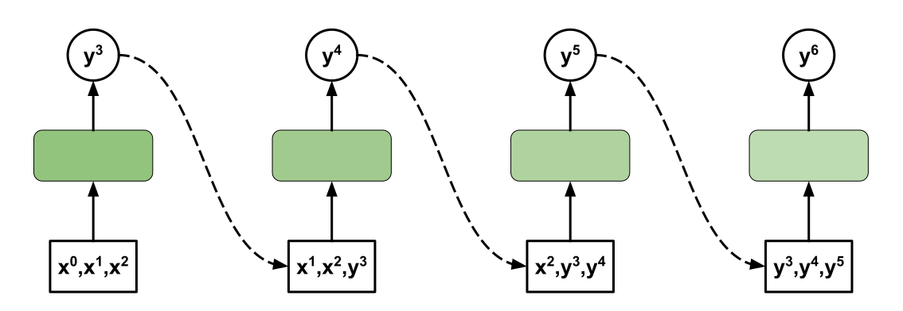

Bien évidemment, au fur et à mesure, les erreurs de prédiction vont avoir tendance à s’accumuler et à partir d’un certain nombre de pas de temps (**horizon de prédiction**) notre trajectoire prédite deviendra peu fiable, et ce d’autant plus vite que le système que nous essayons de modéliser est complexe et non linéaire.

L'**horizon de prédiction** d'un modèle correspond à la *durée qu'il est capable de prédire correctement dans le futur*.

Le même principe peut être utilisé pour faire de la classification. Là, plutôt que d’essayer de prédire une position future d’une trajectoire, nous pourrions essayer de déterminer un type de trajectoire : cercle, droite, parabole, … Notre base d’exemple serait construit à partir de morceaux de trajectoire, associés à son type. Et nous nous retrouvions dans un cas de classification classique, avec les mêmes outils et les mêmes techniques utilisés par exemple pour la classification d’image. Rien de différent, à part la construction de la base d’exemple.

Parce que vous commencez à être des connaisseurs des réseaux profonds, vous sentez bien qu’on rate peut-être quelque chose en procédant de la sorte. Lorsque nous analysons des images, nous avons vu qu’il n’était pas forcément nécessaire de chercher à déterminer d’un coup les relations entre tous les pixels, mais qu’il pouvait être intéressant de déterminer avec une première couche des patterns locaux (les relations entre des pixels voisins), puis dans une couche suivante les relations entre les patterns trouvés avec la couche précédente, et ainsi de suite. C’est ce qui avait conduit à la définition des réseaux convolutifs. Le même principe peut s’appliquer ici, en considérant non plus un voisinage spatial, mais temporel. Pour le réseau, peu importe que le vecteur représente une séquence temporelle plutôt qu’une image (aux dimensions près, bien sûr : une image est de dimension 2, une séquence temporelle est de dimension 1), nous pouvons utiliser le même principe.

Comme pour l’analyse d’image, en utilisant des réseaux convolutifs, nous pouvons espérer obtenir des modèles plus compacts (avec moins de paramètres, donc plus faciles à entraîner) pour des performances équivalentes. Et surtout, comme pour les images, les modèles convolutifs supportent plus facilement d’être utilisés avec des séquences de tailles différentes.

Nous avons vu l’utilisation d’un réseau profond (dense ou convolutif) pour la modélisation d’une séquence de points. Et cela semble bien fonctionner. Mais que ce passe t-il lorsque notre séquence est composée de données plus grandes, et que les relations pertinentes se font entre des éléments plus éloignés dans la séquence, que la dynamique que nous cherchons à modéliser est plus complexe ? Pour modéliser des séquences, nous voulons que nos modèles soient capables de :

1. manipuler des séquences de longueur variables,
2. prendre efficacement en compte l’ordre dans la séquence,
3. capturer les dépendances temporelles à long terme.

Un réseau dense permet de répondre aux critères 2 et 3. Il est cependant probable que cela implique, pour obtenir des résultats satisfaisants, que notre réseau soit plus volumineux (avec plus de couches, plus de neurones dans les couches, et donc plus de paramètres à apprendre), et que la convergence (l’annulation de l’erreur commise lors de l’apprentissage) se fasse plus lentement, voire ne se fasse pas du tout. Un réseau convolutif répondra lui au critère 1, plus difficilement au critère 2, et quasiment pas au critère 3, du fait de l’invariance translationnelle.

C’est pourquoi, il est apparu utile de définir une architecture de réseaux de neurones dédiées au traitement de séquences : les réseaux de neurones récurrents.

### Reseaux de neurones réccurents

#### Principes de fonctionnements

L’idée derrière les réseaux de neurones récurrents (ou réseaux récurrents dans la suite) est assez simple : il s’agit de réinjecter en entrée du réseau l’état du réseau obtenu à l’étape précédente.

Pour bien comprendre comment nous pouvons mettre en œuvre ce principe, repartons du schéma classique d’un réseau de neurones qui associe une entrée à une sortie :

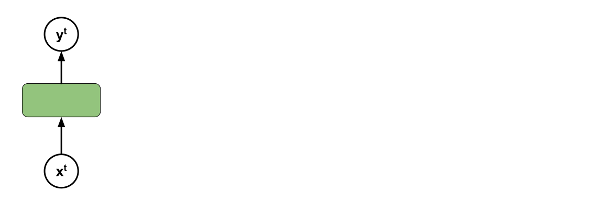

L’entrée de ce réseau est l’élément au temps $$t$$ de la séquence : $$\mathbf{x^t}$$. Si on applique séquentiellement toute la séquence, voilà ce qu’on obtient :

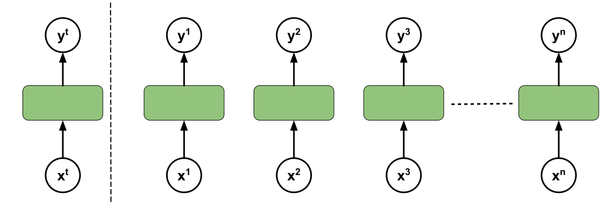

Si nous nous limitons à faire cela, il est impossible d’apprendre les relations temporelles existant entre les éléments de la séquence. Nous sommes dans le cas d’un réseau classique, où $$\mathbf{y^n}$$ est uniquement déterminé par $$\mathbf{x^n}$$ : $$\mathbf{y^n} = f(\mathbf{x^n})$$. Ce qui n’est pas ce que nous souhaitons a priori.

En effet, notre hypothèse est que $$\mathbf{y^n}$$ est une fonction de toute la séquence $$(\mathbf{x^0},\mathbf{x^1},\mathbf{x^2},\ldots,\mathbf{x^n})$$.

Pour que cela soit le cas, nous allons injecter dans le réseau, en plus de l’entrée $$\mathbf{x^t}$$, un **vecteur d’état**, noté $$\mathbf{h^t}$$, calculé par le réseau à l’étape précédente :

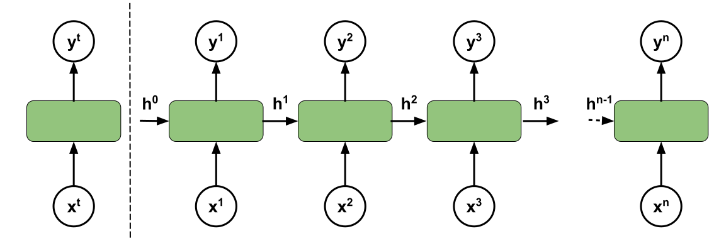

Le vecteur $$\mathbf{h^{t}}$$ est déterminé par une fonction de $$\mathbf{x^t}$$ et $$\mathbf{h^{t-1}}$$ : $$\mathbf{h^{t}}=g(\mathbf{x^t},\mathbf{h^{t-1}})$$.

Le **vecteur d’état** représente *l’histoire du réseau*, c’est-à-dire ce qui s’est passé avant. Quelles ont été les entrées précédentes ? C’est lui qui permet le pont temporel entre les différents pas de temps.

Avec cette architecture, $$\mathbf{y^n} = f(\mathbf{x^n},\mathbf{h^{n-1}})$$.

Mais comme $$\mathbf{h^{n-1}}$$ est lui même calculé à partir de $$\mathbf{x^{n-1}}$$ et $$\mathbf{h^{n-2}}$$, $$\mathbf{y^n} = f(\mathbf{x^n},g(\mathbf{x^{n-1}},\mathbf{h^{t-2}}))$$.

 Et ainsi de suite : $$\mathbf{y^n} = f(\mathbf{x^n},g(\mathbf{x^{n-1}},g(\mathbf{x^{n-2}},\mathbf{h^{n-3}})))$$.
 
 Notez bien les appels récursifs à la fonction $$g$$. C’est bien pour cela que l’on parle de **réseaux de neurones récurrents**.
 
 Au final, notre sortie $$\mathbf{y^n}$$ dépend de toutes les entrées précédentes et d’un vecteur d’état initial : $$\mathbf{y^n} = f'(\mathbf{x^n},\ldots,\mathbf{x^0};\mathbf{h^0})$$.
 
 Le vecteur d’état utilisé pour la première étape, $$\mathbf{h^0}$$, est en général le vecteur nul (dont toutes les composantes sont à 0).

Si on replie temporellement le réseau, on obtient ce schéma, qui est celui qu’on utilise pour représenter pour les réseaux récurrents :

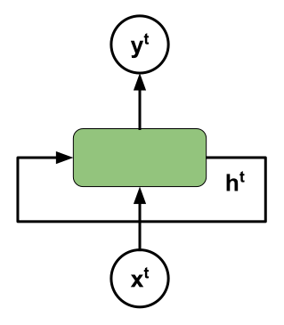

Une couche neuronale récurrente est une couche dont une partie des sorties est ré-injectée en entrée. Un réseau de neurones récurrent est un réseau de neurones contenant au moins une couche récurrente.

#### Structure interne d’un réseau récurrent

Voyons maintenant ce qu’il se passe si on ouvre le capot. Je l’ai dit, un réseau de neurones récurrent est un perceptron avec une couche d’entrée, une couche cachée et une couche de sortie. La particularité est ici qu’aux entrées naturelles (c’est-à-dire les données que l’on souhaite traiter) du réseau, le vecteur $$\mathbf{x^t}$$, on ajoute (il serait plus pertinent de dire « on concatène ») un vecteur de la même taille que la couche cachée. Pour le reste, le fonctionnement est strictement identique à un perceptron multicouche. Voici ce que donnerait une réseau récurrent avec $$q$$ neurones de sortie, $$r$$ neurones cachés et $$p$$ neurones d’entrée :

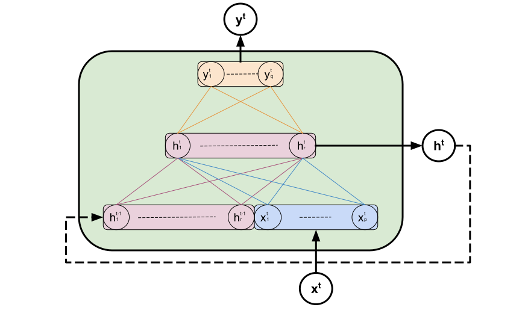

La couche cachée joue le rôle de vecteur d’état (notez que c’est pour cela qu’on note ce vecteur $$\mathbf{h}$$, comme *hidden*, caché en anglais) : les valeurs d’activation des neurones cachés sont recopiées en entrée pour calculer l’itération suivante.

Le calcul de l’activation des neurones de la couche cachée se fait exactement comme dans un perceptron :

$$ h_j^t = act_h(\sum_{i=1}^{i\leq r} W^{hh}_{i,j}.h^{t-1}_i + \sum_{i=1}^{i\leq r} W^{xh}_{i,j}.x^{t}_i + b_j^h) $$

ou en notation matricielle :

$$ \mathbf{h^t} = act_h(W^{hh}.\mathbf{h^{t-1}} + W^{xh}.\mathbf{x^{t}} + \mathbf{b^h}) $$

La fonction $$act_h$$ est la fonction d’activation de la couche cachée. En général, on prend la fonction tangente hyperbolique ($$tanh$$).

La matrice $$W^{hh} \in \mathbb{R}^{r \times r}$$ est composée des poids de connections entre la couche cachée au temps $$t-1$$ et la couche cachée au temps $$t$$, $$W^{xh} \in \mathbb{R}^{p \times r}$$ est la matrice des poids entre les entrées et la couche cachée et $$\mathbf{b^h} \in \mathbb{R}^{r}$$ est le vecteur de biais.

La sortie se calcule ainsi :

$$ \mathbf{y^t} = act_y(W^{hy}\mathbf{h^{t}} + \mathbf{b^y}) $$

avec $$W^{hy} \in \mathbb{R}^{r \times q}$$, la matrice des poids entre la couche cachée et la couche de sortie, et $$\mathbf{b^y} \in \mathbb{R}^{q}$$, le vecteur de biais de la couche de sortie. La fonction d’activation, $$act_y$$ dépend du problème.

Les paramètres réglés pendant l’apprentissage sont les matrices de poids ($$W^{hh}$$, $$W^{xh}$$, $$W^{hy}$$) et les biais ($$\mathbf{b^h}$$, $$\mathbf{b^y}$$).

Cette architecture est un réseau récurrent complet. En pratique, on peut souhaiter avoir des réseaux plus complexes, par exemple en empilant plusieurs couches récurrentes. Pour cela, les plateformes comme **tensorflow/keras** offrent une couche récurrente simple (*keras.layers.SimpleRNN* par exemple avec *tensorflow/keras*), paramétrée par le nombre de neurones dans la couche cachée et dans la couche de sortie. Le schéma interne d’une couche RNN simple est le suivant :

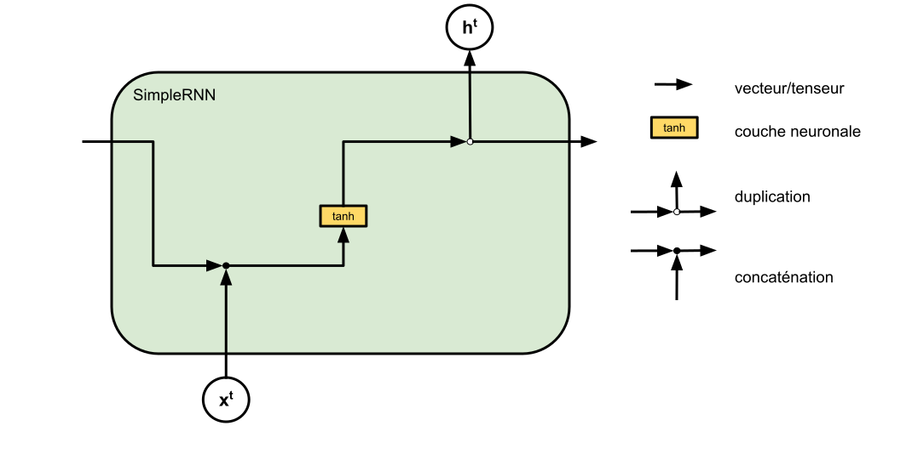

L’entrée de la couche est en bas, la sortie de la couche (le vecteur caché) est en haut. L’entrée à gauche et la sortie à droite symbolisent les informations qui sont transmises d’une itération sur l’autre.

Cette couche est empilable, au même titre qu’une couche dense ou convolutive, ce qui permet de créer des architectures adaptées aux besoins du problème à résoudre. Par exemple, l’architecture suivante est un modèle qui relie une séquence à une sortie unique :

Les couches RNN (SimpleRNN, mais également les couches LSTM ou GRU que nous verrons par la suite) s’utilisent de la même façon que les autres couches, avec quelques paramètres en plus pour gérer les aspects temporels, comme par exemple le type de sortie : une sortie unique, la valeur de $$\mathbf{h^n}$$, ou la séquence $$(\mathbf{h^1},\ldots,\mathbf{h^n})$$, séquence qui peut être utilisée en entrée d’une autre couche RNN, par exemple.

#### Apprentissage des réseaux récurrents

Avant de parler de l’apprentissage, faisons un bref retour sur le fonctionnement d’un réseau récurrent et les paramètres impliqués dans le calcul de la sortie du réseau. supposons qu’on présente successivement au réseau les $$n$$ éléments d’une séquence de vecteurs d’entrée $$\mathbf{x}$$, et que seule la sortie du réseau à la fin de la séquence nous intéresse, le calcul se fera suivant ce schéma (le graphe computationnel déroulé dans le temps) :

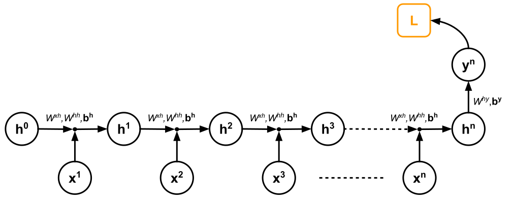

Les matrices de poids et les vecteurs de biais sont identiques tout au long du calcul. Il s’agit bien du même réseau sur lequel sont réappliquées les entrées. Une fois le calcul de $$\mathbf{y^n}$$ réalisé, le calcul de la fonction de perte peut se faire en comparant la sortie obtenue à la sortie désirée. En phase d’apprentissage, l’erreur est rétro-propagée dans le réseau, non seulement spatialement (de la sortie à la couche cachée), mais également à travers le temps (entre les différentes instances temporelles de la couche cachée) :

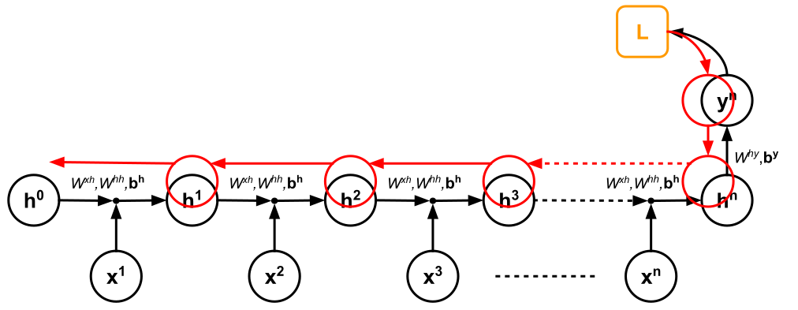

Cet algorithme est la rétro-propagation à travers le temps (ou backpropagation through time en anglais) souvent abrégée en BTT. En calculant ainsi le gradient de la fonction de perte par rapport aux paramètres du réseau $$(W^{hh}$$, $$W^{xh}$$, $$W^{hy}$$, $$\mathbf{b^h}$$, $$\mathbf{b^y}$$), on peut déterminer les modifications à apporter à ces derniers pour la minimiser.

La rétro-propagation à travers le temps (ou backpropagation through time en anglais) est un algorithme d'apprentissage pour les réseaux de neurones récurrents. Il consiste à propager l'erreur commise de la sortie vers les entrées, à travers les différentes couches du réseaux et à travers les itérations successives des couches récurrentes.

Cet algorithme souffre de deux problèmes majeurs qui limitent son application, et qui sont toutes deux liées au calcul du gradient. Si la séquence d’apprentissage est longue, le gradient de la fonction de perte $$\mathbf{L}$$ par rapport aux paramètres implique une longue chaîne de multiplication matricielle. 

Sans entrer dans les détails du calcul, les **gradients peuvent devenir de plus en plus grands**, et conduire à leur explosion ce qui rend l’optimisation impossible.

A contrario, ils peuvent également devenir de **plus en plus faibles**, jusqu’à s’annuler, ce qui empêche également l’optimisation (si les gradients valent 0 pour toutes valeurs, impossible de déterminer dans quelle direction se déplacer).

Cela perturbe la prise en compte des dépendances temporelles longues.

Dans les deux cas, il est possible de limiter la rétro-propagation à $$\mathbf{T}$$ pas de temps, c'est à dire que plutôt que de rétropropager l'erreur commise sur $$\mathbf{h^n}$$ jusqu'à \(\mathbf{h^0}\), elle est stoppée à \(\mathbf{h^{n-T}}$$.

Cela permet de limiter l’instabilité du calcul du gradient, mais en focalisant l’apprentissage sur les temps courts, c’est-à-dire que les influences à long terme ne sont pas prises en compte.

Pour éviter l’explosion des gradients, il est aussi possible de les borner : il suffit de limiter leur valeur absolue. Pour éviter l’annulation des gradients, il est possible de choisir une fonction d’activation ne souffrant pas de ce problème (par exemple, la fonction ReLU déjà vue dans les réseaux très profonds qui peuvent eux aussi souffrir de ce type de problèmes) et d’initialiser les matrices de poids à la matrice identité.

L'explosion du gradient (**gradient exploding**) est le fait que le gradient de l'erreur grandisse de telle manière qu'il devient impossible à calculer.

L'annulation du gradient (**gradient vanishing**) est a contrario le fait que le gradient devienne si petit qu'il ne donne pas d'information sur la direction à prendre pour minimiser la fonction de perte. Les deux phénomènes obèrent la capacité à apprendre du réseau.

Le problème de toutes façons demeure : comment efficacement capturer les dépendances de long terme, c’est-à-dire entre la sortie finale et le début de la séquence ? La rétro-propagation à travers le temps, de par son mode de calcul, donne la priorité aux relations de court terme, voir de très court terme. Cela peut être fortement préjudiciable quand le système que l’on cherche à modéliser contient des relations de long terme, comme par exemple l’analyse de texte en langue naturelle, où le sens d’un mot à la fin d’une phrase peut dépendre d’un mot au début de la phrase. Pour régler ce problème, il faut se tourner vers des architectures plus complexes, les architectures **Long Short Term Memory** ou **Gated Recurrent Unit**.

